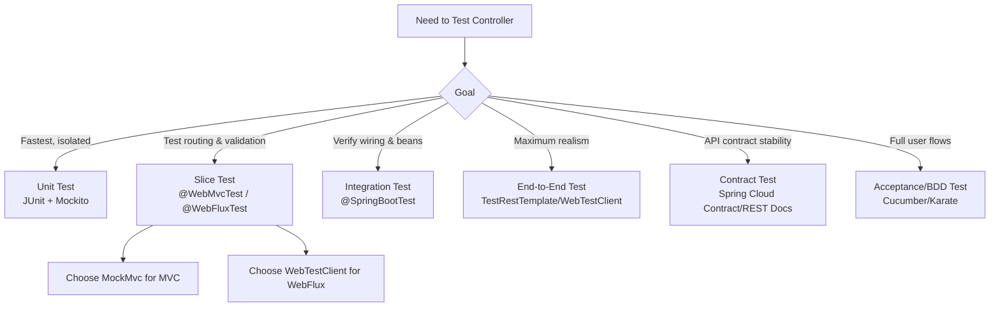

# Testing Spring Controllers in Spring Boot (Old vs Latest) + WebFlux + CI/CD Guidance

This document explains the different ways to test Spring controllers in
Spring Boot, how testing approaches have evolved with newer versions,
how to handle Spring WebFlux reactive controllers, and which tests are
safe to run in CI/CD pipelines without slowing or breaking them.

------------------------------------------------------------------------

## 1. Evolution of Testing Approaches

### Older Spring Boot Versions (2.x and before WebFlux)

-   Focused primarily on **Spring MVC** controllers.
-   Common test methods:
    -   **Unit Tests**: JUnit + Mockito, testing controllers directly
        without Spring context.
    -   **MockMvc**: For testing request mappings, validation, and
        serialization.
    -   **@WebMvcTest**: Slice tests for the web layer with controller +
        Spring MVC infra.
    -   **@SpringBootTest**: Full context tests including controllers,
        services, repositories.
    -   **TestRestTemplate**: End-to-end HTTP-level tests.

### Newer Spring Boot Versions (3.x + Spring 6)

-   Added **Spring WebFlux** (reactive programming) alongside MVC.
-   Testing tools expanded:
    -   **WebTestClient**: For testing WebFlux controllers and also
        usable for MVC.
    -   **StepVerifier**: For verifying `Mono`/`Flux` sequences in
        detail.
-   Emphasis on **slice tests** to reduce startup cost.
-   **Testcontainers** commonly used for integration tests in CI
    pipelines.

### Recent Updates

-   Core testing philosophy hasn't changed, but:
    -   Stronger module boundaries in Spring Boot 3.x.
    -   Better support for reactive testing utilities.
    -   Wider use of contract/API tests (Spring Cloud Contract, OpenAPI
        validation).

------------------------------------------------------------------------

## 2. Ways to Test Spring Controllers

  ------------------------------------------------------------------------------------------------------
  Approach           Target Scope       Tools/Annotations        Pros            Cons
  ------------------ ------------------ ------------------------ --------------- -----------------------
  **Unit Tests**     Controller methods JUnit, Mockito           Fastest, no     Doesn't test HTTP
                     in isolation                                Spring overhead mapping/serialization

  **Slice Tests (Web Controller +       `@WebMvcTest` +          Tests routing,  Services must be mocked
  Layer)**           Spring MVC/WebFlux `MockMvc`, or            validation,     
                     infra              `@WebFluxTest` +         serialization   
                                        `WebTestClient`                          

  **Integration      Full Spring        `@SpringBootTest` +      Ensures wiring  Slower, more
  Tests**            context            `MockMvc` or             correctness     dependencies
                     (controller,       `WebTestClient`                          
                     services, repos)                                            

  **End-to-End       Real HTTP calls    `TestRestTemplate`,      Maximum realism Slowest, may need
  Tests**            against running    `WebTestClient`                          external infra
                     app                                                         

  **Contract/API     Validate           Spring Cloud Contract,   Ensures API     Doesn't test internal
  Tests**            request/response   REST Docs, OpenAPI       compatibility   logic
                     contracts                                                   

  **Behavioral/BDD   Full user journeys Cucumber, Karate,        Captures real   Heavy, harder to
  Tests**                               RestAssured              scenarios       maintain

  **Reactive         Validate reactive  `StepVerifier`           Accurate async  Extra complexity,
  Sequence Tests**   flows                                       behavior        scheduler mgmt
                                                                 validation      
  ------------------------------------------------------------------------------------------------------

------------------------------------------------------------------------

## 3. MVC vs WebFlux Differences

  ------------------------------------------------------------------------
  Concern        MVC Controllers          WebFlux Controllers
  -------------- ------------------------ --------------------------------
  Test client    `MockMvc`                `WebTestClient`

  Return type    `ResponseEntity<T>` or   `Mono<T>` / `Flux<T>`
                 POJO                     

  Execution      Blocking                 Non-blocking

  Verification   Assertions on return     Use `StepVerifier`,
                 values                   `expectNext`, `expectComplete`

  Time control   Rarely needed            May use `VirtualTimeScheduler`
                                          for delays and async ops
  ------------------------------------------------------------------------

------------------------------------------------------------------------

## 4. CI/CD Guidance

### Recommended for CI/CD Pipelines

-   **Unit tests**: very fast feedback.
-   **Slice tests** (`@WebMvcTest`, `@WebFluxTest`): lightweight and
    stable.
-   **Integration tests with Testcontainers**: simulate DB, Kafka, etc.
    reliably.
-   **Contract/API tests**: ensure backward compatibility.

### Caution for CI/CD

-   Heavy **end-to-end tests** may slow pipelines.
-   External dependencies (real DBs, APIs) increase flakiness.
-   Full BDD/acceptance suites are better in nightly builds or staging.

**Rule of thumb**: keep CI/CD tests under a few minutes; delegate
exhaustive tests to separate pipelines.

------------------------------------------------------------------------

## 5. Sample Code Skeletons

### Unit Test (no Spring context)

``` java
class MyControllerUnitTest {
  private final MyService service = mock(MyService.class);
  private final MyController controller = new MyController(service);

  @Test
  void testFoo() {
    when(service.getValue()).thenReturn("ok");
    assertEquals("ok", controller.foo());
  }
}
```

### Slice Test (WebFlux)

``` java
@WebFluxTest(MyController.class)
class MyControllerSliceTest {
  @Autowired WebTestClient webTestClient;
  @MockBean MyService service;

  @Test
  void testFooEndpoint() {
    when(service.getValue()).thenReturn("ok");

    webTestClient.get().uri("/foo")
        .exchange()
        .expectStatus().isOk()
        .expectBody(String.class).isEqualTo("ok");
  }
}
```

### Integration Test (Spring Boot + Reactive)

``` java
@SpringBootTest(webEnvironment = SpringBootTest.WebEnvironment.RANDOM_PORT)
@AutoConfigureWebTestClient
class MyControllerIntegrationTest {
  @Autowired WebTestClient webTestClient;

  @Test
  void testFooIntegration() {
    webTestClient.get().uri("/foo")
        .exchange()
        .expectStatus().isOk()
        .expectBody()
        .jsonPath("$.result").isEqualTo("ok");
  }
}
```

### Reactive Sequence Validation

``` java
Flux<Integer> numbers = Flux.range(1, 3).map(i -> i * 2);

StepVerifier.create(numbers)
    .expectNext(2, 4, 6)
    .expectComplete()
    .verify();
```

------------------------------------------------------------------------

## ✅ Summary

-   You can test controllers via **unit, slice, integration, end-to-end,
    contract, BDD, and reactive tests**.\
-   Across Spring Boot versions, the main difference is **WebFlux
    support** with `WebTestClient` and `StepVerifier`.\
-   **CI/CD pipelines** should prioritize **unit, slice, and lightweight
    integration tests**, with heavier E2E/BDD deferred to
    staging/nightly builds.


---

## 6. Visual Decision Diagram


